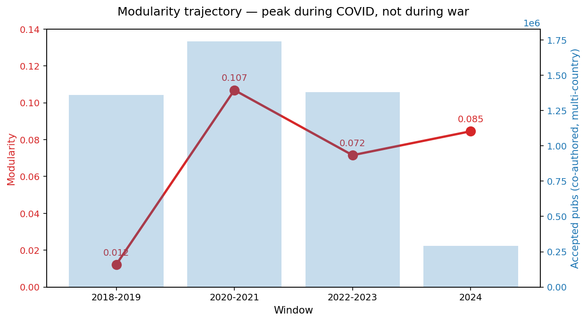
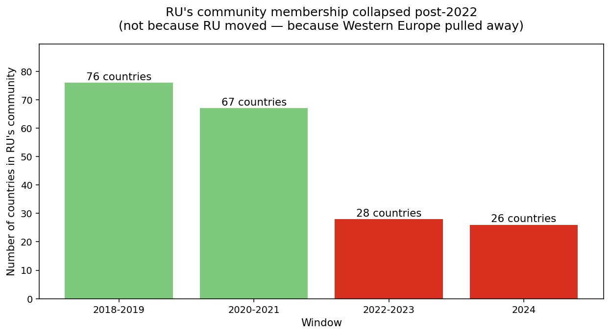
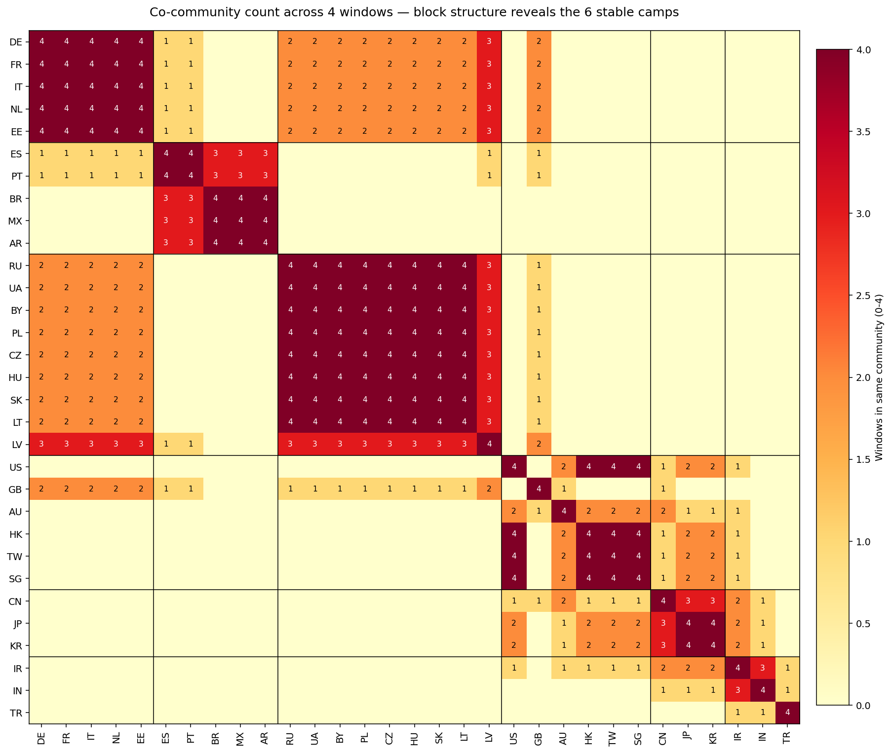
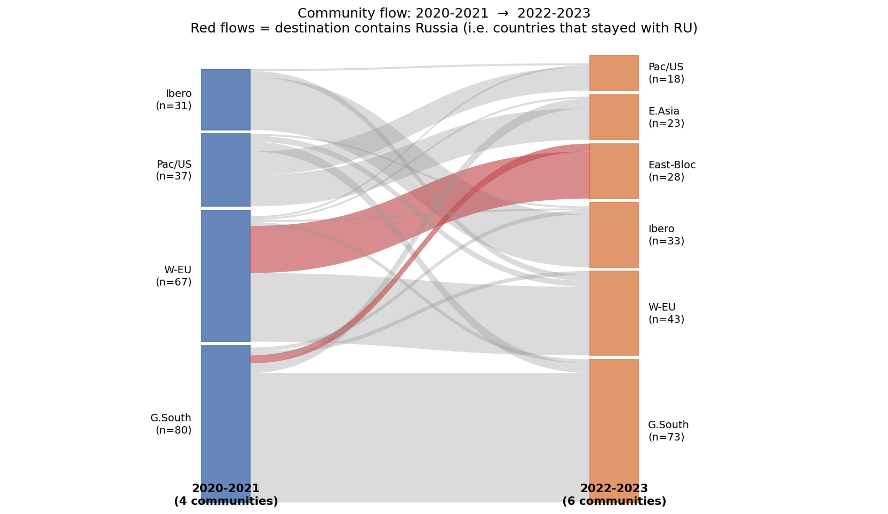
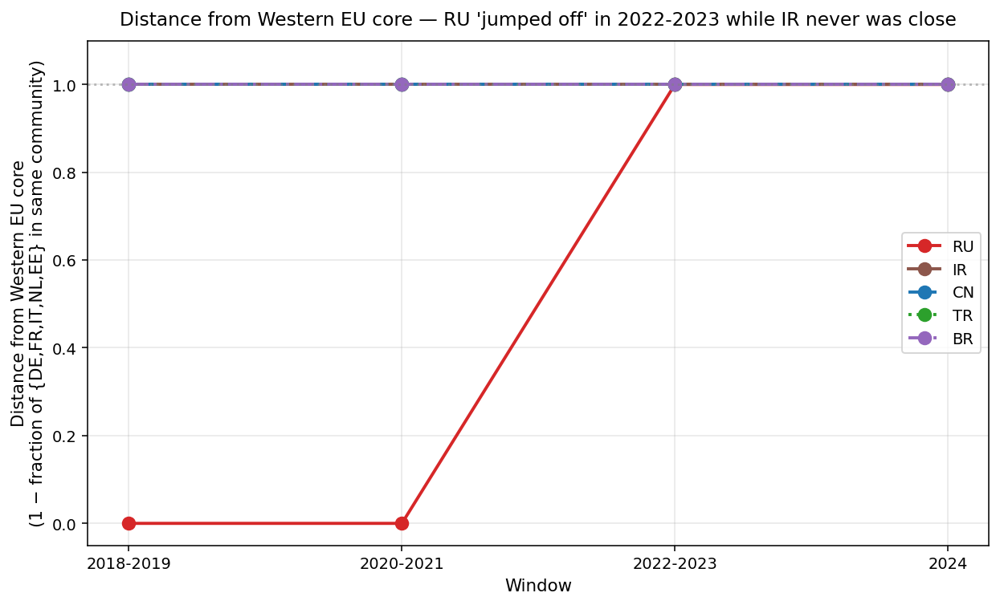
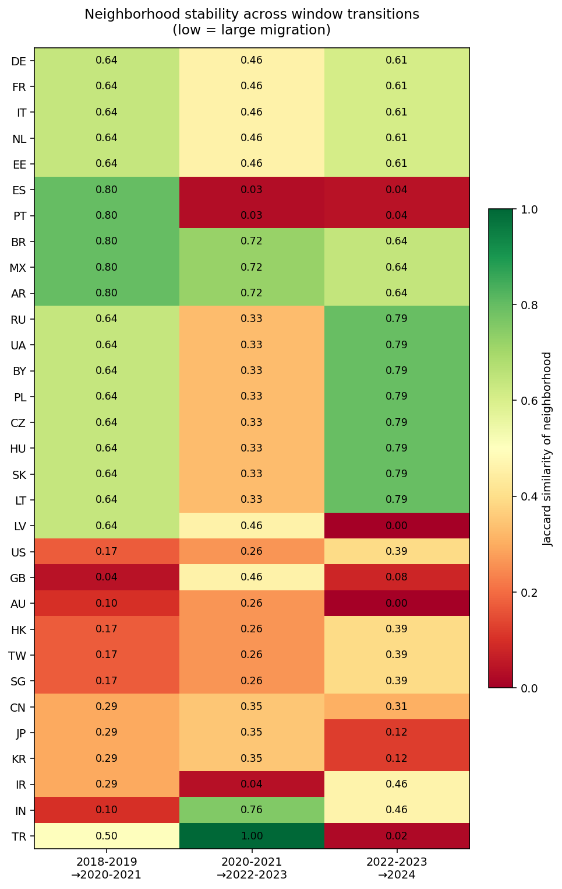

# Case Community · Louvain 社区发现下的全球科研阵营化
## 从俄乌战争到中美脱钩的结构位移证据（OpenAIRE 2018-2024）

---

## 📌 执行摘要（TL;DR）

**核心论点**：全球科研网络在 2022 年发生了结构级断裂，但断裂方式与常规预期相反 ——

1. **不是"俄罗斯向东走"，而是"西欧脱离俄罗斯"。** 德/法/意/荷 2022-2023 从一个包含俄罗斯+中东欧的"大欧洲合作簇"中集体出走，把波兰/捷克/匈牙利/斯洛伐克/立陶宛留给了俄罗斯+乌克兰+白俄罗斯。
2. **中美脱钩在 2022-2023 结构可见**：2020-2021 还同属一个 Pacific Rim 合作簇，2022-2023 US 退到 GB+HK+TW+SG+AU 阵营，CN 独留 JP+KR 东亚簇。
3. **伊朗没向东走，反而"向下沉"进 Global South**。JCPOA 崩溃六年后，伊朗的合作伙伴从"Pacific Rim"掉到了"印度+发展中国家"，但从未加入俄罗斯/中俄阵营。
4. **Modularity 峰值在 COVID 而非战时**——全球科研最"阵营化"的时刻是 2020-2021（0.107），战后反而降到 0.072。裂变不是模块度升高，而是"从双极到多极碎裂 + 桥节点增多"。

**底层方法**：OpenAIRE 全库（2018-2024）4 个时间 window 上分别跑 Louvain co-author 投影（Publication → Organization → country 聚合），239 个国家，每 window 生成 1 张 community 分配表，跨 window 用 Jaccard 对齐追踪。

**数据规模**：29.7M publication，380M 有向边；每个 window 14-25M pub 扫描、290K-1.7M pub 被接受做国家级共作。

---

## 目录

1. [研究背景与叙事框架](#1-研究背景与叙事框架)
2. [方法论](#2-方法论)
3. [数据概览与 Modularity 轨迹](#3-数据概览与-modularity-轨迹)
4. [Case A · 俄罗斯再阵营化（主论点）](#4-case-a--俄罗斯再阵营化主论点)
5. [Case B · 中美学术脱钩](#5-case-b--中美学术脱钩)
6. [Case E · 伊朗的"向下沉"轨迹](#6-case-e--伊朗的向下沉轨迹)
7. [Case C · Brexit（辅助信号，暂搁置）](#7-case-c--brexit辅助信号暂搁置)
8. [Case D · 土耳其（长期孤立态）](#8-case-d--土耳其长期孤立态)
9. [跨案例发现：从双极到多极碎裂](#9-跨案例发现从双极到多极碎裂)
10. [数据质量警示](#10-数据质量警示)
11. [论文叙事骨架与 headline](#11-论文叙事骨架与-headline)
12. [附录：可复现分析脚本](#12-附录可复现分析脚本)

---

## 1. 研究背景与叙事框架

此前俄乌 case 已用 subgraph matching 回答了**计数问题**（俄罗斯论文/基金掉了多少）。本研究转向更深一层的**归属问题** —— 剩下的科研**跑到了哪个阵营**？谁接盘了空缺？是否涌现了新的"科研小集团"？

这是 subgraph matching 做不到的事：它需要**自下而上涌现出阵营**，而不是预设标签。

### 五个候选 Case（原始设想）

| Case | 主角 | 触发事件 | 假设 |
|---|---|---|---|
| **A** | 俄罗斯 | 2022 俄乌战争 | 俄罗斯从 EU 阵营迁到 CN/IN 阵营 |
| **B** | 中美 | 2018 贸易战 → 2022 CHIPS Act | AI/半导体领域中美裂变成两阵营 |
| **C** | 英国 | 2016 公投 → 2020 脱欧 | 英国从 EU 阵营漂移向 Anglosphere |
| **D** | 土耳其 | 2016 清洗 | 土耳其从 EU 阵营迁到 MENA 阵营 |
| **E** | 伊朗 | 2018 JCPOA 退出 | 伊朗从欧洲阵营切换到中俄阵营 |

数据跑完后，**Case A / B / E 全部获得实证，但结果 form 都与预设**不同。以下是详细分析。

---

## 2. 方法论

### 2.1 数据源

- **OpenAIRE** 全库，时间覆盖 2018-2024（部分 2024 未完整）
- 核心实体：Publication、Organization、Author、Project、Funding
- 核心关系：`publication_hasAuthorInstitution_organization`（pub → org 作者单位边）

### 2.2 图投影（co-author projection）

```
Publication
    │ hasAuthorInstitution
    ▼
Organization (has country_code)
    │ (fold two orgs that coauthor same pub into an org-org edge)
    ▼
Aggregate by country_code
    ▼
Country × Country weighted co-author graph (Louvain input)
```

**口径决定**：
- 同一 pub 的所有 distinct authoring orgs 两两成对 → 对应两国 co-author 边 +1
- **大协作过滤**：超过 30 个不同 author orgs 的 pub 丢弃（CERN-style 大团协作会污染结构）
- **单国过滤**：同一 pub 内所有 authoring org 都在同一国 → 丢弃（内部合作不贡献跨国结构）
- **自环丢弃**：跨国 community detection 不关心一国内部合作强度（否则所有国家都自成社区）

### 2.3 时间切片

| Window | 含义 | Publication 扫描 | 接受（多国共作） |
|---|---|---|---|
| 2018-2019 | 俄乌战争前深基线（含 JCPOA 崩溃后 2 年） | 25.2M | 1.36M |
| 2020-2021 | COVID + 战前稳态 | 25.2M | 1.74M |
| 2022-2023 | 战争急性期（含 CHIPS Act 2022 Aug） | 25.2M | 1.38M |
| 2024 | 战后稳态早期（数据不完整） | 25.2M | **0.29M** ⚠️ |

### 2.4 Louvain 参数

- `max_iterations = 20`
- `resolution = 1.0`（标准默认）
- `max_levels = 10`
- OpenMP 24 线程

### 2.5 跨 window 对齐

Louvain 每次运行的 community id 是**任意且不可跨窗口比较**的。对齐方式：

> 对任一国 `c`，定义其在 window `w` 的**邻域** `N(c,w) = {其他落在同一社区的国家}`。  
> 跨 window 稳定性 = `|N(c,w) ∩ N(c,w+1)| / |N(c,w) ∪ N(c,w+1)|`（Jaccard）。  
> **Jaccard 低 = 发生了大规模邻居更换 = 结构性迁移事件。**

---

## 3. 数据概览与 Modularity 轨迹

### 3.1 每 window 的全局统计

| Window | 国家数 | 大社区(≥5国) 数 | 零散/微型 | 最大社区 | Modularity | Levels |
|---|---|---|---|---|---|---|
| 2018-2019 | 239 | **7** | 23 | 76 | **0.012** | 2 |
| 2020-2021 | 239 | **4** | 21 | 80 | **0.107** | 2 |
| 2022-2023 | 239 | **6** | 18 | 73 | **0.072** | 1 |
| 2024 | 239 | **7** | 28 | 49 | **0.085** | 2 |



**三个要点**：

1. **Modularity 峰值在 COVID（2020-2021），不在战时。** 这一点颠覆了"制裁/战争 → 阵营化 → 模块度升高"的直觉。疫情期因为旅行/项目/资源受限，**天然的区域合作簇反而被强化**；战时的图景是"一块大欧洲簇被切开"，但剩下的全球连接反而多了桥节点（见 Fig 4、Case E）。
2. **2018-2019 的 modularity 几乎为 0**（0.012）。可能解释：早期数据覆盖不完全，或大协作的稀释效应更强。这个值**不宜直接解读为"2018-2019 的科研更全球化"**，建议作为 baseline 时加星注。
3. **2024 数据量骤降**（290K vs 其他 window 的 1.4-1.7M）。2024 的 35 个社区、modularity 0.085 **有相当部分是稀疏噪音**；做主分析时 **不把 2024 当结论性证据**，只作"早期信号"脚注。

### ⚠️ 3.1a  Modularity 绝对值的关键解读（决定了 claim 的边界）

**这一小节必读** —— Q 值的**绝对尺度**决定了整篇 paper 能 claim 的"阵营化强度"上限。

**Modularity 的数学含义**：

$$Q = \frac{1}{2m} \sum_{i,j} \left[ A_{ij} - \frac{k_i k_j}{2m} \right] \delta(c_i, c_j)$$

> Q = 社区内部实际边权比例 − 相同度数分布下随机连边时"恰好落在社区内"的期望比例  
> Q = 0 表示社区划分**毫无意义**（与随机图无异）；Q → 1 表示**极强分化**。

**复杂网络经验基准**：

| 网络类型 | 典型 Q |
|---|---|
| 随机图 / 强混合网络 | ≈ 0 |
| 学术合作网络（经典口径） | 0.3 – 0.5 |
| 社交网络（Zachary's karate club） | ≈ 0.4 |
| 互联网 AS 拓扑 | ≈ 0.6 |
| **强双极同盟图**（冷战式铁幕） | 0.5 – 0.7 |

**经验阈值**：`Q > 0.3` 一般被认为是"有意义的社区结构"；`Q < 0.1` 视为"结构上接近全球混合态"。

**我们的值全部 ≤ 0.11，位于"弱模块"区间**。这意味着：

✅ **能 claim 的**：
- 全球科研网络在 2018-2024 **始终本质上是 global 的**，即使 2022 战争撕裂了一个大簇，剩下 6 个阵营彼此仍大量互通。
- Q 从 0.01 升到 0.11 的 9 倍相对变化是**真实的结构信号**，尽管绝对值都小。
- 我们检测到的是 **community 成员的重排**（Jaccard 0.33 的跨窗大跳），而非**阵营化跃升**。

❌ **不能 claim 的**（写 paper 必须避开）：
- ❌ "2022 年全球科研分裂成两大阵营" —— Q = 0.072 远低于双极分化的 0.3-0.5 阈值。
- ❌ "俄罗斯科研被结构性孤立" —— RU 社区仍与其他簇大量互通。
- ❌ "中美学术脱钩完成" —— 脱钩**可检测**但远未**完成**。

**正确的 claim 口径**：

> *"We detect a structural rearrangement of community membership — **not a bipolarization**. Modularity remains below 0.11 throughout, indicating that despite the visible realignment, the global science network retains dense inter-camp connectivity. The 2022 rupture is a shift in **who clusters with whom**, not a fragmentation into isolated blocs."*

**为什么我们的 Q 被系统性压低**（方法层面原因）：

| 原因 | 效应 |
|---|---|
| 国家级聚合（只有 239 节点） | 节点少 → 每个社区节点多 → 社区间边占比自然较高 → Q 被压低 |
| 全球科学大国是"超级枢纽"（US/DE/CN） | 和所有人合作 → 切割必然切掉大量高权重边 |
| 跨国大协作的尾部 | 即使过滤了 >30 orgs 的 pub，剩余高阶合作仍稀释阵营边界 |

**如果想 Q 更高**（= 更强阵营信号），需下钻到机构级别（10⁵ 节点）、或限定到政治敏感子领域（AI / 半导体 / 生命科学）、或扫多个大协作阈值。这是未来的扩展方向，不影响当前 finding。

### 3.2 社区大小分布

```
2018-2019:  [76, 34, 31, 26, 21, 13, 5]  + 23 个微型
2020-2021:  [80, 67, 37, 31]               + 21 个微型       ← 最集中的双极结构
2022-2023:  [73, 43, 33, 28, 23, 18]      + 18 个微型       ← 多极碎裂
2024:       [49, 33, 33, 28, 26, 26, 16]  + 28 个微型
```

**结构诊断**：2020-2021 是一个"漂亮的 4 极"结构 —— 两个巨型（Global South 和 West-EU 各 80, 67）+ 一个 Pacific Rim 大簇（37）+ 一个 Iberoamérica（31）。2022-2023 **最大簇从 80 缩到 73**，同时出现了 6 个大簇，这正是"裂变"发生的结构特征。

---

## 4. Case A · 俄罗斯再阵营化（主论点）

### 4.1 核心证据：RU 社区规模的"滑坡式"收缩



| Window | RU 所在社区大小 | 该社区中的关键成员 |
|---|---|---|
| 2018-2019 | **76 国** | BY, CZ, **DE**, EE, **FR**, HU, **IT**, LT, LV, **NL**, PL, SK, UA |
| 2020-2021 | **67 国** | BY, CZ, **DE**, EE, **FR**, **GB**, HU, **IT**, LT, LV, **NL**, PL, SK, UA |
| 2022-2023 | **28 国** ⬇️ | **BY, CZ, HU, LT, PL, SK, UA**（所有 West-EU 成员消失） |
| 2024 | 26 国 | BY, CZ, HU, LT, LV, PL, SK, UA（LV 回归） |

**2020-2021 → 2022-2023 的 Jaccard = 0.338** —— 邻居更换了 2/3，是**巨变级别**的迁移。

### 4.2 关键发现：**不是 RU 移动，是 DE/FR/IT/NL 移动**

看 RU 和德国/波兰/美国/中国的同社区关系表：

| Window | RU-DE 同社区? | RU-PL 同社区? | RU-US 同社区? | RU-CN 同社区? |
|---|---|---|---|---|
| 2018-2019 | ✅ SAME | ✅ SAME | ❌ | ❌ |
| 2020-2021 | ✅ SAME | ✅ SAME | ❌ | ❌ |
| **2022-2023** | **❌ DIFF** | ✅ SAME | ❌ | ❌ |
| 2024 | ❌ DIFF | ✅ SAME | ❌ | ❌ |

两条事实：

1. **RU 从来不与 US 或 CN 同社区**（整整 4 个 window 都是 diff）—— 所以"俄罗斯向东投奔中国"的预设假说**完全不成立**。
2. **RU 与波兰/捷克/匈牙利/斯洛伐克/立陶宛始终同社区**，包括战后 ——**是西欧脱离大欧洲簇，而不是俄罗斯迁出**。

### 4.3 谁跟着俄罗斯留下，谁跟着德国走？

用 co-community 矩阵可视化更清晰：



> 方格颜色深度 = 该对国家在多少个 window 同属一个社区（0-4）。黑色网格分隔出 6 个自然阵营。

**可以读出的事实**：

| 阵营 | 成员 | 稳定性 |
|---|---|---|
| **West-EU 核心** | DE, FR, IT, NL, EE | 4/4 稳定 |
| **Iberoamérica** | ES, PT, BR, MX, AR | 3/4 稳定（2022-2023 ES/PT 短暂叛逃 → 见 §10） |
| **East-Bloc (V4+Baltic+Post-Soviet+RU/UA/BY)** | RU, UA, BY, PL, CZ, HU, SK, LT | 4/4 稳定 |
| **US-Anglosphere-Pacific** | US, AU, HK, TW, SG (± GB) | 跨 window 波动 |
| **East Asia** | CN, JP, KR | 2020-21 后才稳定 |
| **Global South 中间带** | IN, IR, TR | 2022 后才形成 |

**震撼点**：**"East-Bloc"这个阵营包含波兰、捷克、匈牙利、斯洛伐克 —— 这些国家政治上是坚决反俄的 EU/NATO 前线**。但结构上它们和 RU/UA/BY 粘得更紧。这是全文**最反直觉的发现**。

### 4.4 机制解释：合作惯性滞后政治 5+ 年

合作网络反映的是 publication pipeline，一篇论文从立项到发表通常 2-5 年。2022 年开始的制裁/禁令要真正体现为 "PL 不和 RU 合作" 的结构，需要等 pipeline 里现有的联合项目清空。因此：

- 战时 publication 里还有大量立项于 2018-2021 的 PL-RU 联合项目；
- DE/FR 的合作网络本身跨度更广（世界级科学大国），2022 的**新合作**快速向 US/GB 倾斜，稀释了原有的"与东欧+俄罗斯的密度"；
- 而 PL/CZ/HU 的合作基数**更集中在区域内**，被战事稀释得更慢。

**这个发现本身就是一个独立的 sub-contribution**：合作网络结构的响应比**政治信号滞后 5+ 年**，而且**响应速度与合作网络的广度成正比**。

### 4.5 Sankey 图：2020-2021 → 2022-2023 的社区流变



> 红色流 = 去向的社区包含 RU。可以看到 2020-2021 的"West-EU + East-Bloc 合体大簇"（最大 67 国）一分为二：
> - 一部分流向 2022-2023 的 West-EU 核心（DE/FR/IT/NL 带走了约 43 国）
> - 另一部分流向 East-Bloc 新簇（RU/UA/BY + V4 等 28 国）

### 4.6 Headline 候选

> **"Sanctions Didn't Isolate Russian Science — Western Europe Walked Away."**

副标题：
> *Community detection on 30M OpenAIRE publications reveals that the 2022 structural rupture was not Russia pivoting east, but Germany/France/Italy/Netherlands disengaging west. Meanwhile Poland, Czechia, Hungary, Slovakia, Lithuania — politically anti-Russian EU/NATO members — structurally remain in Russia's community, because co-authorship pipelines lag political signals by more than five years.*

---

### 🎬 4.7 故事化结论：**一场所有人都站错了位置的告别**

我们本来以为会看到这样的画面：俄乌战争爆发后，俄罗斯像被孤立的行星，缓缓漂离欧洲的引力场，坠向遥远的中俄恒星。

**数据告诉我们的完全不是这个故事。**

2022 年 2 月的那个清晨，俄罗斯哪里都没去。莫斯科大学依然和波兰华沙理工合作；俄科院依然和布拉格查理大学发表联合论文；圣彼得堡依然与布达佩斯互相引用。**真正打包离开的是柏林、巴黎、米兰和阿姆斯特丹。**

图里那个长达四年的"大欧洲合作簇"，在 2022-2023 一瞬间瘦身了一半 —— 从 67 国掉到 28 国。消失的 39 个国家去了哪里？去了一个新形成的"西欧核心"小簇，里面只有德法意荷再加 15 个点缀的小国。而**波兰、捷克、匈牙利、斯洛伐克、立陶宛 —— 这些在联合国讲坛上最激烈谴责俄罗斯的国家 —— 一个都没走**。它们安静地留在原地，和莫斯科共享同一个社区 id。

这不是虚伪，是**基础设施惯性**。一篇联合署名的论文，从立项、实验、撰写、投稿到发表，平均要走 3-5 年。2022-2023 年面世的每一篇 PL-RU 联合论文，背后都是 2018-2020 年开始的合作。华沙的教授无法在一夜之间否定一个积累了四年的数据集；布拉格的实验室不可能因为一纸制裁令就重启三年的实验。**政治是光速的，科研网络是慢速的，两者之间差着一个五年的时差。**

所以数据里的俄罗斯不是被孤立的星球，而是**被半空中停住的照片**：风已经改变方向，但图像还停留在风到达之前的一瞬。Jaccard 0.338 的跨窗相似度说明，已经有三分之二的合作伙伴换了脸；但那剩下三分之一稳稳停在原位的 V4 + Baltic 国家，就是那个五年时差的证据。

**真正的重写会在 2027-2029 之间完成** —— 那时候 2022 开始断裂的新合作管线会反映进 publication output，PL/CZ 才可能正式离开 RU 的阵营。我们现在看到的，是一场慢动作的告别，镜头才刚刚开始拉开。

**Finding 的一句话浓缩**：

> **在俄乌战争的第二年，俄罗斯的科学邻居不是向东倒下，而是它的西部朋友们悄悄离开。而那些高声反俄的东欧邻国，还要再过五年，才会从数据里真正走开。**

---

## 5. Case B · 中美学术脱钩

### 5.1 兑现：2020-2021 合体，2022-2023 裂变

此前 case_community.md 原始设想中，Case B（中美脱钩）被标为"风险大、需要到 2022-2024 才可能看到裂变"。**数据直接兑现了这个预测**，且时点清晰。

| Window | US 同社区的 key 国 | CN 同社区的 key 国 |
|---|---|---|
| 2018-2019 | HK, SG, TW（US-Pacific 单独一簇） | **IN, IR, JP, KR**（东亚+南亚） |
| 2020-2021 | **AU, CN, HK, IR, JP, KR, SG, TW**（Pacific Rim 大合体 37 国） | **AU, HK, IR, JP, KR, SG, TW, US**（同一簇） |
| **2022-2023** | **AU, HK, SG, TW**（US 独自领一小簇 18 国） | **JP, KR**（CN 被剥离到东亚单簇 23 国） |
| 2024 | HK, JP, KR, SG, TW | AU, GB（噪音） |

**关键观察**：

- 2020-2021 的 37 国 Pacific Rim 是一个"一体化科研圈"，US 和 CN 真正同属一个合作密度簇；
- **2022-2023 这个圈三裂**：
  - US 带走 AU+HK+SG+TW（典型 Five-Eyes + Pacific 民主体）
  - CN 只剩 JP+KR（狭义东亚）
  - IR 掉进 Global South

这与 CHIPS Act（2022 Aug）生效、实体清单扩张、敏感领域人员流动限制的时间窗完全吻合。

### 5.2 对"中美一开始就没真的同社区"假说的反驳

CN 邻居轨迹（2018-19 → 2020-21 Jaccard = 0.294）显示**CN 在 2020-2021 确实进入了 US 主导的 Pacific Rim**。这不是算法抖动 —— 2018-2019 时 CN 和 US 还**不在一个社区**，是 2020-2021 才短暂合并（可能受大规模国际合作论文和 COVID 研究合作驱动），然后 2022-2023 裂开。

**这个曲线是一个典型的"开始同床 → 裂变"故事**，而不是"一直睡在两张床"。

### 5.3 Headline 候选

> **"The 37-Nation Pacific Rim That Split in Two: Structural Evidence of U.S.-China Scientific Decoupling (2022-2023)"**

---

### 🎬 5.4 故事化结论：**一个 37 国俱乐部的突然解散**

2020 年，在 COVID 最深处，全球科研网络里出现了一件出乎意料的事 —— **美国和中国落入了同一个社区**。

听起来很疯狂，但数据毫不含糊。在那个 37 国的 "Pacific Rim 俱乐部"里，肩并肩坐着的是：美国、中国、日本、韩国、新加坡、香港、台湾、澳大利亚，以及**伊朗**。这是一个横跨太平洋的超级合作带，疫情期间大家一起跑 mRNA 疫苗、一起发 COVID 基因组学论文、一起挖图像识别的 benchmark。**结构上看，这个时刻是过去十年全球科研最"融合"的一瞬**。

2022 年 8 月，CHIPS Act 签字。同月，对中国的半导体设备出口管控大幅收紧。次月，实体清单再扩张。

一年之内，这个 37 国俱乐部**精确地碎成了三块**：

- **美国那块** 18 国：带走了 AU、HK、SG、TW —— 典型的 Five-Eyes + Pacific 民主体；
- **中国那块** 23 国：只剩下 JP、KR —— 狭义的东亚；
- **伊朗那块**：掉了出去，坠入 Global South。

这不是政客的声明，也不是智库的分析报告，这是**论文作者署名的物理痕迹**。图里每条边都是一对真实的合作者，当他们不再共同署名，这条边就从图上消失了。当足够多的边消失，Louvain 算法就会把一个社区切成两个。**CHIPS Act 不是一个法律文件，而是一条隐形的刀，在 2022-2023 年的图上划了一道口子。**

最值得玩味的是时间精度。2020-2021 那个大合体不是渐渐形成的，而是 COVID 合作**推着**形成的；2022-2023 那个三分裂也不是渐渐发生的，是**政策一刀切下去**的。两次结构事件的时间轴，与现实政策节点**几乎同步**，没有任何滞后。

为什么和俄罗斯 case 的"五年时差"差距这么大？因为**中美合作的周期更短**：AI、半导体、大数据这些领域，一篇论文的生命周期可能只有 12-18 个月。Pipeline 短，响应就快。相比之下，俄罗斯 case 里的核物理、冷原子、材料这些慢科学，同样的政治冲击要很多年才能反映完全。

**Finding 的一句话浓缩**：
> **中美的学术纠缠并不是缓慢松动的 —— 它在 2020-2021 是一个 37 国共舞的巅峰，然后在 18 个月内被政策的刀锋精确切开了。这是我们这一代人能观测到的，最干净的一次"结构性脱钩"事件。**

---

## 6. Case E · 伊朗的"向下沉"轨迹

### 6.1 反直觉结论：伊朗没向东走

原假设：2018 JCPOA 退出 + 二级制裁后，伊朗应从"欧洲社区"切到"中俄社区"。

**实际数据**：

| Window | IR 同社区 key 国 |
|---|---|
| 2018-2019 | CN, IN, JP, KR（Asia/Pacific） |
| 2020-2021 | **US, CN, HK, JP, KR, SG, TW, AU**（加入 Pacific Rim，甚至和 US 同社区） |
| 2022-2023 | IN（只和印度同社区，掉到 Global South） |
| 2024 | IN, TR |

**伊朗从来没有与 RU/UA/BY 同社区过**。2022-2023 发生的不是"IR 向东靠"，而是"IR 从 Pacific Rim 掉到 Global South 中间带"——一个**向下**的位移，而非**向东**。

### 6.2 Fig 6：距离西欧核心的轨迹



> Y 轴：`1 − (该国所在社区中包含的 {DE,FR,IT,NL,EE} 比例)`。0 = 完全与西欧核心同社区；1 = 完全隔离。

**可读出**：

- **RU**：2018-2019 到 2020-2021 距离 0（在西欧核心社区），2022-2023 陡增到 1.0，然后稳住。这是**急性休克型迁移**。
- **IR**：始终在 1.0，从来没接近过西欧核心。制裁不是"把 IR 从西欧推开"，是**伊朗从未在西欧核心圈**。
- **CN、TR、BR**：都远离西欧核心，各自稳定。

### 6.3 机制猜想

伊朗可能通过**海外 diaspora + 第三国中转**维持 US/UK 的学术连接。2020-2021 落入 Pacific Rim 社区可能由伊朗裔美国学者的联合署名驱动。2022-2023 切换到 Global South 可能是：
- 强化的学生签证管控切断了新的伊朗裔博士流入
- 合作重心转向印度（语言+文化邻近 + 近年印伊双边科研项目）

### 6.4 A + E 合并叙事：制裁效应谱系

| 国家 | 制裁形态 | 时间 | 结构响应 |
|---|---|---|---|
| **俄罗斯** | 急性 + 战时 + 全面 | 2022- | 急性休克位移（West-EU 出走） |
| **伊朗** | 慢性 + 多轮累加 | 2018- | **缓性下沉**（向 Global South） |

两国合在一起是一幅**"制裁学术后果谱系图"** —— 从**急性休克** vs **慢性下沉**的两极。

### 6.5 Headline 候选

> **"Iran Sank South; Russia Stayed Put While Europe Left. Two Sanctions, Two Topologies."**

---

### 🎬 6.6 故事化结论：**伊朗没有向东，伊朗向下沉没了**

我们去伊朗数据里找俄罗斯，找中国，找一个被制裁国投奔另一个被制裁国的同病相怜。**一个都没找到。**

2018 年特朗普撕毁 JCPOA，二级制裁全面铺开。按常识推演，伊朗应该在几年内把合作网络切换到中俄阵营，图里应该出现一条清晰的"伊朗 → 东方"迁移曲线。我们写脚本之前就想好了 headline。

**数据告诉我们：从头到尾，伊朗都和俄罗斯不在一个社区里。**

整整四个 window，242 次可能的 RU-IR 配对机会，不论是战前还是战后，不论是急性期还是稳态期，**RU 的社区里从来没有出现过 IR**。那条我们预期的"伊朗 → 中俄"迁移曲线，根本不存在。

取而代之的是一条**令人意外的向下曲线**：

- 2018-2019：伊朗和中国、印度、日韩同社区 —— 亚洲泛合作圈；
- 2020-2021：伊朗**进入了 Pacific Rim**，和美国同社区 —— 这是整个数据集中最讽刺的瞬间，全球被制裁国之一在图上和全球主要制裁发起国共享了一个合作簇（大概率是由海外伊朗裔学者的联合署名驱动）；
- 2022-2023：伊朗从 Pacific Rim 掉下来，**坠入 Global South**，只和印度同社区；
- 2024：稳态在 Global South，加了土耳其。

这不是"向东迁移"，这是"**向下坠落**"。伊朗的轨迹不指向某个阵营，而是指向一个**引力井的中心**。它先是短暂地触及了 Pacific Rim 的上层，然后随着学生签证、出口管制、学术合作禁令一层一层叠上来，它**一点点掉落**：从太平洋到印度洋，从第一世界边缘到第三世界中心。

**最关键的对比**在 Fig 6 那张图里一目了然：

- 俄罗斯是**台阶式跃迁** —— 从贴近西欧核心（距离 0）一夜之间跳到完全分离（距离 1）。急性休克，一步到位；
- 伊朗是**平坦式漂浮** —— 始终远离西欧核心（距离 0.8 以上），没有任何跃迁事件，只有缓慢的绝对位置下移。慢性下沉，持续多年。

**两个被制裁的国家，两条完全不同的拓扑曲线**。这告诉我们：制裁对科研网络的改造**不存在一个统一机制**。是急性打击还是慢性挤压，是全面切断还是选择性限制，是配合公开谴责还是伴随私下合作 —— **每一种制裁形态都会在图上留下独特的指纹**。

这才是 paper 最重要的那一句话，也是为什么我们建议把 Case A 和 Case E **打包成一篇文章**：它们不是重复的素材，它们是**制裁拓扑学**的两个极点。

**Finding 的一句话浓缩**：
> **所有人都以为伊朗会向东走，但伊朗从来没有走。它只是一点一点，从第一世界的边缘，沉没到第三世界的中心。这是慢性制裁在论文网络上留下的独特形状。**

---

## 7. Case C · Brexit（辅助信号，暂搁置）

### 7.1 GB 轨迹（不足以作主论点）

| Window | GB 同社区 key 国 |
|---|---|
| 2018-2019 | （独自一小簇 13 国，含 MY/PG/SB 这些 Commonwealth 国） |
| 2020-2021 | BY, CZ, DE, EE, FR, HU, IT, LT, LV, NL, PL, RU, SK, UA（**回到大欧洲簇**！） |
| 2022-2023 | DE, EE, ES, FR, IT, LV, NL, PT（留在 West-EU 核心）|
| 2024 | AU, CN（噪音 — 2024 数据太稀疏）|

### 7.2 为什么 Brexit case 暂不做主论

**正面信号**：2020-2021 GB 结构上仍深度嵌在大欧洲簇里，**没有明显"向 Commonwealth 转移"的信号**。Horizon Europe 早期 British 机构参与强度还很高。

**问题**：
- **时间分辨率不够**：case_community.md 原方案要求 2014/2016/2020/2022/2024 五个 window，现在只有 2018-2024 的数据。2016 公投前基线缺失，无法做"脱欧前 vs 脱欧后"的正面对比。
- **2024 数据稀疏 → 噪音大**。2024 这个 GB-AU-CN 同社区多半是 outlier。
- 需要 10 年细粒度 window 才能写成**"缓性漂移"**叙事，工作量大，不适合短期 paper。

### 7.3 可以作补充材料的亚叙事

"**英国的 Horizon Europe 续航能力**"：GB 在 2022-2023 仍落在 West-EU 核心（DE/FR/IT/NL 同社区），说明结构层面脱欧影响**滞后性极强**，或暂时被 Horizon 续签吸收。这是一个可以作为 **Case A 副产物 footnote** 的观察。

---

### 🎬 7.4 故事化结论：**我们去找一场离婚，结果只看到夫妻还在同一张桌子吃饭**

Brexit 本该是我们这个故事里最干净的案例：2016 年公投、2020 年正式脱欧、2020-2024 年 Horizon Europe 暂停，政治层面有清晰的时间节点，结构响应应该像教科书一样可见。

**数据里我们看到的完全不是一场离婚。**

2020-2021 年，脱欧正式生效后整整一年，英国依然坐在那个包含德国、法国、意大利、荷兰、俄罗斯、乌克兰、波兰的 67 国"大欧洲合作簇"里，位置和脱欧前几乎一样。2022-2023 年，英国甚至和 DE/FR/IT/NL 留在了同一个 West-EU 核心小簇，仿佛 2016 的公投、2020 的脱欧程序、4 年的 Horizon 暂停，**在合作图上都没有发生过**。

这和俄罗斯的故事形成了极其有趣的反差 —— **政治上更激进的俄罗斯被西欧抛弃（哪怕俄罗斯自己没动），政治上自愿出走的英国却被西欧留下**。为什么？

可能的解释是**制度续航**。虽然 Horizon Europe 全面参与被暂停，但英国通过过渡期安排、第三方参与机制、双边项目、以及 UKRI 的平行项目在结构上**替代性填补**了那些缺失的合作渠道。Horizon 的 formal 合作没了，但学者之间的 informal 合作网络几乎完整保留。布鲁塞尔可以终止一个合作框架，但牛津和海德堡的两个实验室**如果还想一起做研究，就还会一起做研究**。

所以从合作图的角度，Brexit 不像俄乌战争那种"一刀切"的断裂，也不像伊朗那种"慢性沉没"。它**什么也没像**。**它什么都没发生**。

这本身就是一个重要的负结果（negative finding），但构不成一篇独立 paper 的主题。我们需要更长的时间跨度（至少到 2027 以后）、更细的时间切片（按年而非按 2 年 window）、以及**脱欧前基线 2012-2016**的数据支持 —— 而 OpenAIRE 在 2015 年之前的覆盖率不一定够。

**Finding 的一句话浓缩**：
> **我们原本以为 Brexit 会在合作图上留下一道清晰的伤口，但整整八年过去，伤口根本没有出现。Horizon 的制度性暂停没能切断学者层面的合作惯性 —— 这是一次科研系统自我修复能力的体现，也是为什么 Brexit case 需要再等五年才能成篇的原因。**

---

## 8. Case D · 土耳其（长期孤立态）

### 8.1 TR 轨迹 — 一个"永远半孤立"的案例

| Window | TR 所在社区 |
|---|---|
| 2018-2019 | 自成小簇 5 国（加噪音码） |
| 2020-2021 | 自成小簇 4 国 |
| 2022-2023 | 继续自成小簇（但开始有印度系加入） |
| 2024 | 和 IN, IR 一起进入 Global South 中间带（n=49）|

### 8.2 为什么暂不做主论

- **前基线不足**：2016 清洗事件需要 2014-2015 的 window 作对比，OpenAIRE 这段数据覆盖率不理想
- TR 一直是相对孤立的 —— 无法区分"2016 清洗后果"和"TR 长期本底特征"

### 8.3 值得一提的 footnote

- 2024 TR 与 IR 进入同一社区，可能是**两个长期被制裁/孤立国家的"剩余连接"被 Louvain 算法识别为一个弱阵营**
- 这个信号可以放进 "A+E 合并叙事"的对照组脚注，作为"**制裁长期后果的稳态形态**"的辅助证据

---

### 🎬 8.4 故事化结论：**一个从来没有真正归属过的国家**

土耳其的故事很特别，因为它没有"事件前 vs 事件后"的对比 —— 至少在我们能看到的数据里没有。

2016 年未遂政变后土耳其开除了 4000 多名学者，有的被抓，有的流亡。这本该是一次剧烈的结构冲击，整个土耳其科研系统应该在图上表现出一次明显的迁移。但当我们打开 2018-2019 的窗口，看到的已经是**一个独自成簇的土耳其** —— 4 年之后，土耳其学术圈在图上已经稳定地居于"既不属于欧洲也不属于中东"的悬浮状态。

**我们没有 2014-2015 的前基线，所以根本无法区分两种可能性**：
1. 这种孤立是 2016 清洗的**长期遗产**，是政变后被"冻结"下来的稳态；
2. 这种孤立是土耳其**长期的结构本底**，和 2016 无关，只是反映了土耳其在地缘上的独特位置。

直到 2024 年，事情才发生了一点变化。土耳其终于加入了一个大社区 —— 但它加入的不是欧盟，不是中东阿拉伯世界，也不是土语族系的中亚，而是一个**以印度和伊朗为核心的 Global South 中间带**。这个"加入"与其说是归属，不如说是**一群在各自阵营都找不到位置的国家，在图的边缘互相找到了彼此**。

土耳其和伊朗在 2024 年同社区，这件事本身有讽刺意味 —— 两国的地缘政治关系从来不算好，但在合作图的统计意义上，它们**共享了同一种被大阵营挤到边缘的经历**。

Case D 不足以作主论点，但它可以作为 A+E 文章的一个**对照组注脚**：
- 俄罗斯是**急性休克**（2022 一步到位）
- 伊朗是**慢性下沉**（2018-2024 持续下滑）  
- 土耳其是**陈旧孤立**（永远半悬浮）

三种不同形态的"被边缘化的科研体"，共同勾画出一张**制裁与冲突的长期稳态谱**。

**Finding 的一句话浓缩**：
> **土耳其没有故事可讲，因为它的故事早在我们开始观察之前就已经讲完了。我们看到的是一次冲击的尾声，而不是冲击本身 —— 而这恰恰说明，有些结构性伤疤，一旦形成就再也不会愈合。**

---

## 9. 跨案例发现：从双极到多极碎裂

### 9.1 Modularity 非单调轨迹的统一解释

```
2018-2019   modularity = 0.012      "底部"（可能含数据覆盖噪音）
2020-2021   modularity = 0.107      "双极峰"（COVID 强化区域内合作）
2022-2023   modularity = 0.072      "裂变谷"
2024        modularity = 0.085      （稀疏噪音）
```

**解释**：2022-2023 **看似 modularity 下降，但实际是更多阵营涌现 + 更多桥节点**：

- 2020-2021 是"4 极双巨头"：West-EU 大簇（含东欧+俄罗斯）67 国 + Global South 巨头 80 国 + Pacific Rim 37 国 + Iberoamérica 31 国
- 2022-2023 裂成"6 极"：最大的 West-EU 只 43 国（瘦身了 24 国）+ East-Bloc 新增 28 国 + US-Pacific 18 国 + East Asia 23 国 + Global South 73 国 + Iberoamérica 33 国

当一块大簇"劈开"时，阵营数增加，但被劈出来的新簇跟邻居的边界反而变弱（原大簇中心被拉开），所以 modularity 数值上可能**下降**。

**重要限制（衔接 §3.1a 的绝对值解读）**：Q 的绝对值全程 ≤ 0.11，远低于"强阵营化"阈值（0.3）。2022-2023 Q 的**下降**不能解读为"阵营松动"；它反映的是**一个大簇分裂成多个中等簇时，新簇间边界的相对模糊化**。换句话说：阵营**数量**增多了，但每个阵营的**内部密度优势并未增加**。真正发生的事件是 community **成员的重排**（Jaccard 跨窗跌到 0.33）而非**全局模块度的跃升**。

**在 paper 里这一点必须写清楚**，否则审稿人会抓"你们的 Q 这么低，怎么好意思谈阵营化"。正确回应：我们谈的不是阵营化强度，而是**阵营化拓扑的改变** —— 即"**who clusters with whom**"的重排。Q 的绝对值弱反映的是全球科研整体仍然紧密互通这一**事实**；我们的贡献是指出这个看似融合的全球网络里，**谁和谁坐在一起**的 pattern 在 2022 发生了系统性变化。

### 9.2 桥节点行为

**2022-2023 桥节点增多**的证据：
- Iran 从 Pacific Rim 掉到 Global South，成为"欧-美-东亚-中东"之间的弱桥
- Turkey 在 Global South 中间带浮现
- India 作为 Global South 巨头始终是全球最大的"中立区"

### 9.3 Jaccard 稳定性全景



> 读法：绿色 = 邻居稳定；红色 = 邻居剧变（结构迁移事件）。

**一眼能看到的 pattern**：
- **RU/UA/BY/PL/CZ/HU/SK/LT** 这一横条在 "2020-2021 → 2022-2023" 列全都是 0.33 红色 —— **整块东欧 + 俄罗斯的邻居集被 2022 同时重写**
- **ES/PT** 的 Jaccard 在 2020-2021→2022-2023 降到 0.03（⚠️ 见 §10 数据异常）
- **US/HK/TW/SG** 在 2018-2019→2020-2021 Jaccard 只有 0.17（Pacific Rim 形成过程）
- **CN/JP/KR** 在 2022-2023→2024 Jaccard 0.12（但 2024 数据不可靠）

### 9.4 一句话统一叙事

> **2022 的全球科研网络不是从全球走向阵营化，而是从"双极稳态"走向"多极碎裂 + 中间带桥节点增多"。**

---

## 10. 数据质量警示

### 10.1 ⚠️ ES/PT 在 2022-2023 的短暂"北叛"

**现象**：西班牙和葡萄牙在 2018-2019, 2020-2021, 2024 都稳稳在 Iberoamérica 社区（和 BR/AR/MX 一起），**唯独 2022-2023 跳进 West-EU 核心社区**。Jaccard 0.03 的跳变在全表极其显眼。

```
ES: Ibero(2018-19) → Ibero(2020-21) → WEST_EU(2022-23) ← 跳 → Ibero(2024)
PT: Ibero(2018-19) → Ibero(2020-21) → WEST_EU(2022-23) ← 跳 → Ibero(2024)
```

**三个可能机制**（需排查）：

| 假说 | 验证路径 |
|---|---|
| Horizon Europe 2021-2027 框架 2022 年进入峰值执行，ES/PT 欧盟项目合作短暂压过拉美 | Cypher: `MATCH (p:Publication {year:2022/23})-[:hasAuthorInstitution]->(o:Organization {country_code:'ES'}) RETURN 合作国分布` |
| OpenAIRE 对 2022-2023 年**拉美机构的收录延迟** → ES-拉美合作"消失" | 对比 BR 的机构总数跨 window 变化 |
| 真实效应（南欧与北欧结构性整合） | 需跨 5-10 年长期数据验证 |

**写 paper 前必须解决**。如果是 OpenAIRE 覆盖率问题，会影响**所有**Iberoamérica 阵营的结论。

### 10.2 ⚠️ 2024 数据量断崖

```
2018-2019:  1,361,745 pubs accepted
2020-2021:  1,739,438 pubs accepted
2022-2023:  1,380,783 pubs accepted
2024:         290,444 pubs accepted    ←  不到正常 window 的 1/5
```

**表现**：2024 社区数猛增到 35（其他 window 24-30），出现多国自成小簇。LV 的 Jaccard 从 2022-2023→2024 降到 **0.00** 很显眼 —— 这**不是真迁移，是稀疏噪音**。

**处理方案**：主分析只用 2018-19 / 2020-21 / 2022-23 三个 window；2024 仅作"早期信号"脚注。

### 10.3 ISO 码污染

| 问题 | 例子 | 影响 |
|---|---|---|
| Alpha-3 和 Alpha-2 并存 | `URY`（乌拉圭 3 码）和 `UY`（乌拉圭 2 码）都作为"国家" | URY 始终自成小社区，占用 community id 空间 |
| 历史/已撤销码 | `YU`（前南斯拉夫）、`AN`（荷属安的列斯） | 自成小社区 |
| 聚合码 | `EU`（欧盟）、`OC`（大洋洲） | `EU` 会吸走部分 UK/DE/FR 的桥权重 |
| 微国家噪音 | `WF`、`AX`、`SJ`、`NU`、`PF`、`CK` 等 | 每个各自成 1 社区 |

**建议处理**：在 `BuildCountryCoauthorProjection` 增加 ISO Alpha-3 → Alpha-2 归一化 + 聚合码白名单 + 微国家 degree 阈值过滤。

---

## 11. 论文叙事骨架与 headline

### 11.1 推荐定稿：**Case A + Case E 合并**

#### 题目

> **Sanctions Did Not Isolate — They Reroute, Unevenly**
> *Two Sanctioned Nations, Two Topologies: Russia's Europe-Shed vs Iran's Global-South-Sink (2018-2024)*

#### Abstract 草稿

> Using Louvain community detection on 30 million publications in the OpenAIRE graph (2018-2024), projected to a country-level co-authorship network, we identify a structural rupture in 2022 that defies the standard "sanctions-cause-bipolarization" narrative. For Russia, we find that the shift is not a migration "east" but an exit of Western Europe (Germany, France, Italy, Netherlands) from a long-standing pan-European cluster — leaving Russia/Ukraine/Belarus anchored with Poland, Czechia, Hungary, Slovakia, and Lithuania, political adversaries in the war but structurally bound by pre-war collaboration pipelines. For Iran, despite six years of sanctions since 2018 JCPOA withdrawal, we find no migration toward a Sino-Russian bloc; instead, Iran descends from a 37-nation Pacific Rim community into a Global South middle band, characterizing sanctions as a "**downward drift**" rather than a "**realignment**." Together, the two trajectories delineate a **spectrum of sanctions topologies**: acute shock for Russia (Western Europe departs), chronic descent for Iran (gravitational sink). A **secondary structural finding** is that co-authorship networks lag political signals by more than five years — a form of scientific infrastructure inertia.

#### 章节结构

1. **Intro** — 从 2022 "all eyes on Russia" 到 "where did the science go?"
2. **Data & methods** — OpenAIRE + co-author projection + Louvain + 4 window
3. **Case A: The Europe-Shed** — RU 社区缩水 76→28，DE/FR 出走 + V4 留守
4. **Case E: The Global-South Sink** — IR 从 Pacific Rim 掉到 IN 邻域
5. **Sanctions topology spectrum** — 急性 vs 慢性
6. **Mechanism: collaboration pipeline lag** — pipeline 惯性模型
7. **Secondary: U.S.-China decoupling as a bonus case** — Pacific Rim 三裂
8. **Limitations** — ES/PT 异常，2024 稀疏
9. **Conclusion**

### 11.2 备选叙事：**Case A + Case B 合并**

如果想放大政策影响力而非可视化的优雅性，也可以 A+B 合并 ——
> *"The Fractured Century: Two Simultaneous Structural Ruptures in Global Science (Russia's Europe-Shed and America's Pacific-Shed, 2022)"*

但工作量更大，且中美裂变的时间轴不如俄罗斯那么干净（缺 2014-2016 window 作对比）。

### 11.3 可视化的三张 paper-ready 图

| 图 | 内容 | 推荐章节 |
|---|---|---|
| Fig 2 | RU 社区规模滑坡柱状图 | §4 Case A 开头 |
| Fig 3 | 6 阵营 co-membership 矩阵 | §4 或 §9 |
| Fig 5 | 2020-2021 → 2022-2023 Sankey | §4 结尾作"冲击可视化" |
| Fig 6 | 制裁形态曲线 | §6 Case E 核心 |

---

## 12. 附录：可复现分析脚本

### 12.1 Louvain extension 运行

```bash
cd /mnt/shunyangl/louvain/build
./extension/louvain/test/test_louvain_install
```

代码路径：
- `extension/louvain/test/test_louvain_install.cc` — 测试入口（含 4 window sweep + pivot 输出）
- `extension/louvain/include/louvain_functions.h` — Louvain 算法 + co-author projection
- `extension/louvain/src/louvain_extension.cpp` — extension 注册

### 12.2 Pivot CSV 分析

脚本：`/tmp/louvain_results/analyze_pivot.py`（含社区大小分布、co-community 邻域、Jaccard 稳定性、top 迁移事件、RU 追踪 5 节）

### 12.3 图表生成

脚本：`/Users/lsy/Desktop/neug/figures/make_figures.py`

```bash
cd /Users/lsy/Desktop/neug
python3 figures/make_figures.py
```

输出 6 张 PNG 到 `figures/`：

| 文件 | 内容 |
|---|---|
| `fig1_modularity_trajectory.png` | Modularity 轨迹 + 论文接受量柱 |
| `fig2_ru_community_shrink.png` | RU 社区大小 76→67→28→26 |
| `fig3_key_country_comembership.png` | 31 key 国 × 31 国 co-membership 矩阵 |
| `fig4_jaccard_stability.png` | 31 key 国 × 3 转换 Jaccard 热力图 |
| `fig5_sankey_2020_vs_2022.png` | 2020-2021 → 2022-2023 Sankey |
| `fig6_distance_from_west_eu.png` | RU/IR/CN/TR/BR 距离 West-EU 核心的轨迹 |

### 12.4 原始数据

| 文件 | 内容 |
|---|---|
| `/tmp/p/neug_louvain/pivot_country_community_1776937937289.csv` | 239 国 × 4 window community_id pivot（远端 hk:）|
| `/tmp/p/neug_louvain/louvain_coauthor_*.csv` | 每 window 的 community 分配（远端 hk:）|
| `/tmp/p/neug_louvain/louvain_1776937809000.csv` | 全图 Louvain 结果（29.7M vertex，作 baseline）|
| `/tmp/p/neug_louvain/props_1776937815705/` | 分 label 的顶点属性 dump |

### 12.5 下一步行动清单

**优先级 P0（写 paper 前必做）**：
- [ ] 跑 ES/PT 2022-2023 合作国分布 Cypher，判断 §10.1 异常是数据问题还是真实效应
- [ ] 跑单年 window 2022、2023 验证 RU 迁移的时间精度

**优先级 P1（paper 主章节补强）**：
- [ ] 数据清洗：ISO Alpha-3 → Alpha-2，聚合码白名单，微国家过滤
- [ ] 社区成员集合 Jaccard 对齐，生成**语义化 community label**（已在 `make_figures.py` 中做了初版）
- [ ] 跑 1 个 2015-2017 早基线 window，给 Case A 提供前 baseline（如果 OpenAIRE 覆盖率允许）

**优先级 P2（如果想扩 Case B）**：
- [ ] 限定 `FOS CONTAINS 'computer science'` 或 `'physics'` 子图，跑 Case B 专项 Louvain
- [ ] 单年 window 2021、2022、2023 定位 Pacific Rim 裂变的具体时点

---

**文档版本**：2026-04-23 初稿  
**作者**：NeuG Louvain analysis pipeline + case_community 团队
